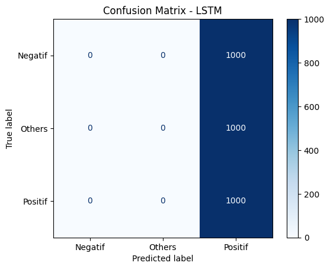
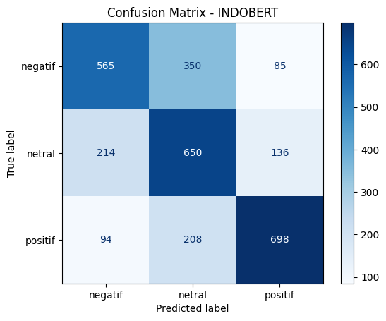
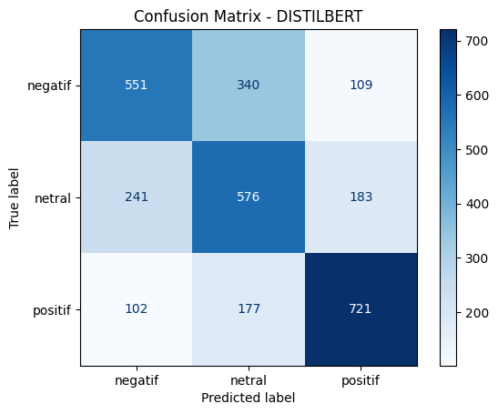
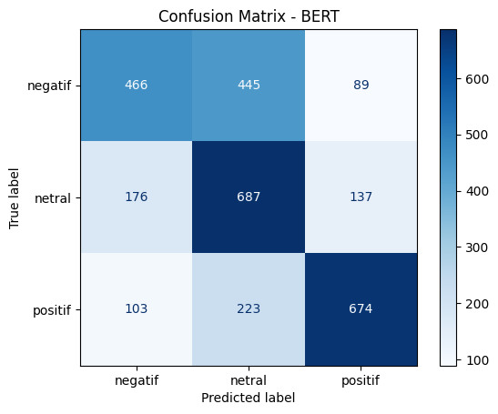
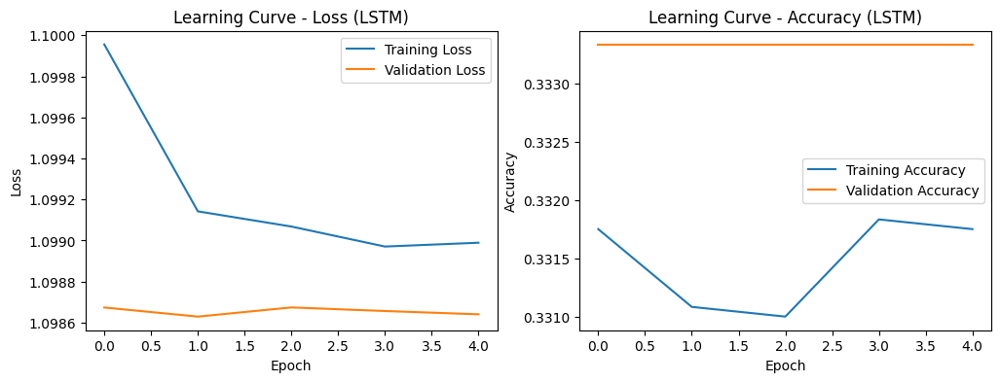
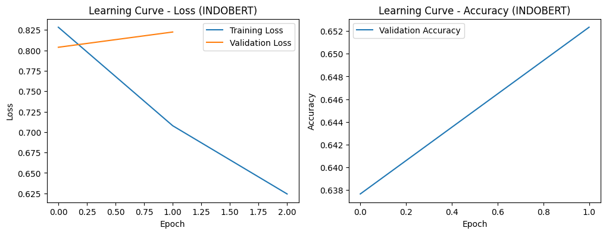

# Klasifikasi Sentimen Komentar Game Genshin Impact (UAP)

---

## 📑 Table of Content
1. [Deskripsi Proyek](#deskripsi-proyek)
2. [Dataset](#dataset)
3. [Preprocessing](#preprocessing)
4. [Model yang Digunakan](#model-yang-digunakan)
5. [Evaluasi Model](#evaluasi-model)
6. [Analisis Hasil](#analisis-hasil)
7. [Sistem Website (Streamlit)](#sistem-website-streamlit)
8. [Cara Menjalankan Aplikasi (Lokal)](#cara-menjalankan-aplikasi-lokal)

---

<h1 id="deskripsi-proyek" align="center">📌 Deskripsi Proyek 📌</h1>

Proyek ini merupakan tugas **Ujian Akhir Praktikum (UAP)** yang bertujuan untuk melakukan  
**klasifikasi sentimen terhadap komentar pemain game Genshin Impact** berbahasa Indonesia.

Analisis sentimen dilakukan menggunakan pendekatan **Machine Learning**, dengan membandingkan
model **non-pretrained** dan **pretrained (transfer learning)** berbasis **Deep Learning**.

Selain itu, proyek ini dilengkapi dengan **sistem website sederhana berbasis Streamlit**
untuk mendemonstrasikan hasil prediksi sentimen secara interaktif.

---

<h1 id="dataset" align="center">📊 Dataset 📊</h1>

- **Jenis Data**: Data teks (komentar pemain)
- **Bahasa**: Bahasa Indonesia (campuran istilah game & bahasa Inggris)
- **Sumber Data**: Hasil scraping komentar pemain Genshin Impact
- **Jumlah Data**: ±15.000 komentar

### Label Sentimen
- Negatif  
- Netral (Others)  
- Positif  

📌 Karena ukuran dataset cukup besar, dataset **tidak diunggah langsung ke GitHub**.

👉 **[Link Dataset – Google Drive](https://drive.google.com/drive/folders/1XkfMcM0EVBMt7h1sIF6AGkisJ5mdnME9?usp=sharing)**

Dataset merupakan **hasil scraping dan pelabelan mandiri**, digunakan **khusus untuk keperluan akademik**.

---

<h1 id="preprocessing" align="center">🧹 Preprocessing 🧹</h1>

Tahapan preprocessing yang dilakukan meliputi:

- Case folding (mengubah teks menjadi huruf kecil)
- Menghapus URL dan karakter non-alfabet
- Menghapus data kosong
- Pelabelan sentimen otomatis berdasarkan rating pengguna
- Encoding label menggunakan `LabelEncoder`
- Pembagian data latih dan data uji (**80:20**)

**Catatan:**  
Proyek ini **tidak menggunakan data augmentation**, karena pada data teks augmentasi berpotensi
mengubah makna dan label sentimen.

---

<h1 id="model-yang-digunakan" align="center">🧠 Model yang Digunakan 🧠</h1>

### 1️⃣ LSTM (Non-Pretrained)
- Arsitektur: **Embedding + LSTM + Dense**
- Digunakan sebagai **baseline model**
- Dilatih dari awal tanpa bobot pretrained

### 2️⃣ BERT (Pretrained)
- Model: `bert-base-uncased`
- Pendekatan: **Transfer Learning**
- Memberikan peningkatan performa signifikan dibandingkan LSTM

### 3️⃣ DistilBERT (Pretrained)
- Versi ringan dari BERT
- Lebih efisien secara komputasi
- Performa kompetitif

### 4️⃣ IndoBERT (Pretrained)
- Model: `indobenchmark/indobert-base-p1`
- Dirancang khusus untuk Bahasa Indonesia
- **Model dengan performa terbaik**

📦 Model tidak diunggah ke GitHub karena keterbatasan ukuran file  
📥 Model tersedia melalui Google Drive (tautan sama dengan dataset)

---

<h1 id="evaluasi-model" align="center">📈 Evaluasi Model 📈</h1>

Evaluasi dilakukan menggunakan:
- Accuracy
- Precision
- Recall
- F1-score
- Confusion Matrix
- Learning Curve (Loss & Accuracy)

### Tabel Perbandingan Performa Model

| Model       | Accuracy | Precision (Macro) | Recall (Macro) | F1-score (Macro) |
|------------|----------|-------------------|----------------|------------------|
| LSTM       | 0.33     | 0.11              | 0.33           | 0.17             |
| BERT       | 0.63     | 0.63              | 0.63           | 0.63             |
| DistilBERT | 0.62     | 0.62              | 0.62           | 0.62             |
| **IndoBERT** | **0.64** | **0.65** | **0.64** | **0.64** |

---

### Confusion Matrix 🔴🟢

| LSTM | IndoBERT |
|------|----------|
|  |  |

| DistilBERT | BERT |
|------------|------|
|  |  |

---

### Learning Curves 📉

| LSTM | IndoBERT |
|------|----------|
|  |  |

---

<h1 id="analisis-hasil" align="center">🔍 Analisis Hasil 🔍</h1>

Model **pretrained berbasis Transformer** secara konsisten mengungguli model **LSTM non-pretrained**.

**IndoBERT** memberikan performa terbaik karena:
- Pretraining khusus Bahasa Indonesia
- Lebih baik menangkap konteks informal & istilah game
- Stabil dan seimbang antar kelas

Hal ini menunjukkan bahwa **Transfer Learning sangat efektif** untuk klasifikasi sentimen teks Bahasa Indonesia.

---

<h1 id="sistem-website-streamlit" align="center">🌐 Sistem Website (Streamlit) 🌐</h1>

Aplikasi Streamlit digunakan untuk mendemonstrasikan prediksi sentimen secara interaktif.

### Fitur:
- Input komentar pengguna
- Pilihan model (LSTM / BERT / DistilBERT / IndoBERT)
- Prediksi sentimen secara real-time

---

<h1 id="cara-menjalankan-aplikasi-lokal" align="center">▶️ Cara Menjalankan Aplikasi (Lokal)</h1>

### 1️⃣ Install Dependensi
```bash
pip install streamlit tensorflow transformers torch scikit-learn
